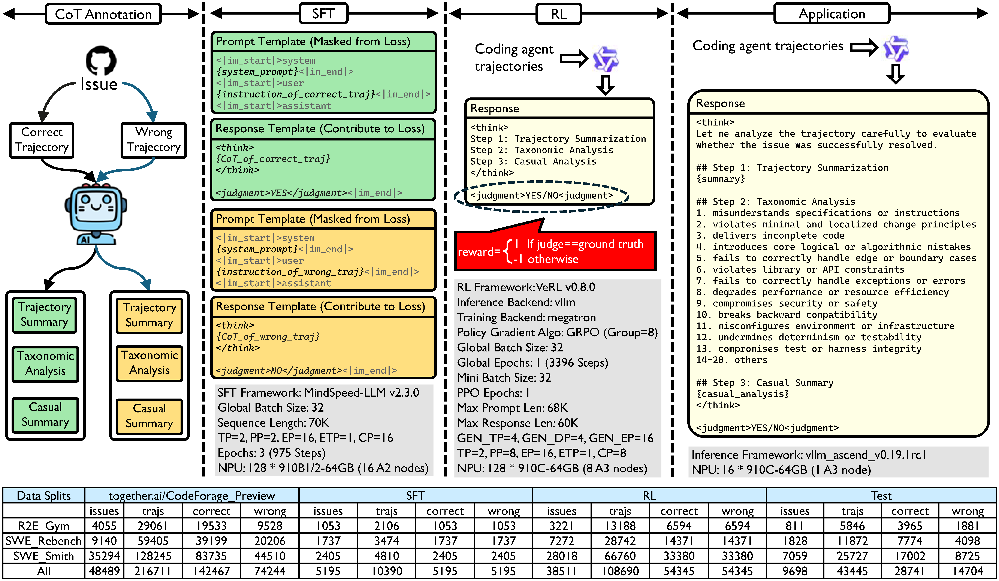
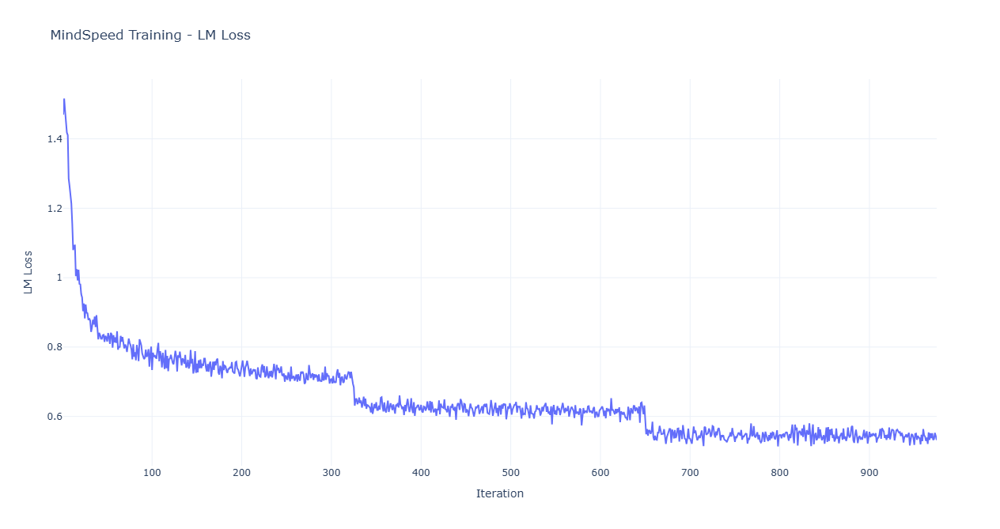
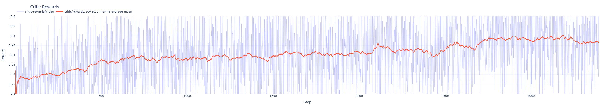

<div align="center">
  
  
  <h1>SWE-Critix: Post-training Generalist Verifiers for Assessing Coding Agent Trajectories</h1>
</div>

<div align="center">

[](https://arxiv.org/pdf/xxxx.xxxxx)
[](https://github.com/SWE-Critix/SWE-Critix)
[](https://huggingface.co/SWE-Critix)
</a>

</div>


SWE-Critix presents an LLM post-training pipeline for evaluating coding-agent trajectories ([Figure 1](#fig1)). The trained model (verifier) takes a trajectory as input, which consists of an issue or requirement description and the agent's recorded process of implementing a solution. If the model determines that the trajectory successfully resolves the issue or fulfills the requirement, it outputs `<judgment>YES</judgment>`; otherwise, it outputs `<judgment>NO</judgment>`. Before making the binary judgment, the model also produces a chain-of-thought (CoT) rationale that justifies its decision. The rationale includes a summary of the trajectory, an analysis of the error type, and a causal analysis of the factors leading to the success or failure of the trajectory (Figure 1 - Application).

<br>

<div id="fig1" align="center">
  
  <p style="font-size: 0.9em; color: #666;">Figure 1: SWE-Critix Post-training Pipeline</p>
</div>

<br>

SWE-Critix adopts a three-stage post-training pipeline. First, a teacher model is prompted to analyze a pair of correct and incorrect trajectories for the same issue. Through comparative analysis, the teacher summarizes the respective procedures, key differences, error types, and factors contributing to the success or failure of each trajectory. These summaries serve as the CoT rationales for subsequent training (Figure 1 - CoT Annotation). The resulting dataset with annotated CoT rationales is then assembled into SFT training samples, which are used to fine-tune the model (Figure 1 - SFT). Finally, SWE-Critix applies reinforcement learning to the remaining trajectories without CoT annotations. The unit testing results of the trajectories are used as the ground truth for computing the reward signal (Figure 1 - RL).

We open source the model weights, datasets, and training scripts 
- [SFT](https://huggingface.co/SWE-Critix/SWE-Critix-Qwen3-30B-A3B-SFT-Epoch3) and [RL](https://huggingface.co/SWE-Critix/SWE-Critix-Qwen3-30B-A3B-RL-Step-3396) checkpoints
- [SFT](https://huggingface.co/datasets/SWE-Critix/alpaca_style_sft_dataset), [RL](https://huggingface.co/datasets/SWE-Critix/rl_dataset), and [Test](https://huggingface.co/datasets/SWE-Critix/test_dataset) datasets
- [SFT](./scripts/sft) and [RL](./scripts/rl) training scripts (tested on Ascend 910 NPUs)


## Data Collection

We collect the training and evaluation data from [CoderForge-Preview](https://www.together.ai/blog/coderforge-preview). The dataset contains 258K test-verified trajectories (155k pass | 103k fail) spanning 51K tasks across 1,655 repositories. These trajectories were generated by [Qwen3-Coder-480B](https://huggingface.co/Qwen/Qwen3-Coder-480B-A35B-Instruct) with [OpenHands v0.52.1 scaffold](https://www.openhands.dev/) from three different task sources: [R2E-Gym](https://arxiv.org/abs/2504.07164), [SWE-Rebench](https://arxiv.org/abs/2505.20411), and [SWE-Smith](https://arxiv.org/abs/2504.21798). The statistics are summarized in [Table 1](#tab1), where trajectory lengths are measured in tokens.

<br>

<div id="tab1" align="center">
  <p style="font-size: 0.9em; color: #666;">Table 1: CoderForge-Preview Trajectory Characteristics</p>

| Task Source | Issues | Repos | Trajs | Passed Trajs | Median Len | Average Len | P99 Len | 
| ----------- | ------ | ----- | ----- | ------------ | ---------- | ----------- | ------- |
| R2E-Gym | 4,216 | 9 | 32,964 | 20,904 | 39,599 | 42,149 | 83,549 |
| SWE-Rebench | 9,764 | 1,577 | 77,169 | 44,739 | 41,996 | 45,236 | 99,391 |
| SWE-Smith | 37,221 | 124 | 148,001 | 89,501 | 36,008 | 39,313 | 88,101 |
| Total | 51,201 | 1,655 | 258,134 | 155,144 | 38,052 | 41,398 | 91,150 |
  
</div>

<br>

We further curate the dataset using the following three rules. A trajectory is discarded if it satisfies **any** of the following conditions:

1. **reward == -1**. In CoderForge-Preview, `reward = 1/0` indicates that the trajectory passes or fails the tests, while `reward = -1` has no clear meaning.
2. **Trajectory length > 65,536**. Trajectories exceeding the length limit are filtered out. Since [CoderForge-Preview Hugging Face repository](https://huggingface.co/datasets/togethercomputer/CoderForge-Preview) directly provides tokenized trajectories, we compute the trajectory length using `len(input_ids)`.
3. **Incomplete trajectory**. If the agent itself does not consider the task to be completed, there is no need to further evaluate the trajectory. To identify such trajectories, we extract the final assistant message from each trajectory and use [Qwen3.5-27B](https://huggingface.co/Qwen/Qwen3.5-27B) to determine whether the task has been completed ([Prompt Template](./prompt_templates/exam_openhands_finish_message_prompt_template.txt)).

We then split the data into SFT, RL, and test sets according to the following procedure:

1. We randomly sample 20% of the issues and use all trajectories associated with them as the test set.
2. Among the remaining issues, if an issue contains both successful and failed trajectories, we randomly select one trajectory of each type and assign them to the SFT set.
3. For the RL set, we first include all failed trajectories and then sample successful trajectories in a round-robin fashion across issues until the two classes are balanced. This maximizes both the number of trajectories and the coverage of distinct issues.

The final data distribution is summarized in [Figure 1 — Data Splits](#fig1).


## CoT Annotation

We use a more capable teacher LLM to generate CoT annotations. Specifically, for each pair of successful and failed trajectories of an issue in the SFT set, we instruct the teacher LLM to comparatively analyze the two trajectories, identifying the root causes of failure in the failed trajectory and the key reasons for success in the successful trajectory. We use [pairwise_evaluate_coding_agent_trajectories.txt](./prompt_templates/pairwise_evaluate_coding_agent_trajectories.txt) as the prompt template, where `{traj_1}` and `{traj_2}` correspond to the failed and successful trajectories, respectively. The teacher LLM produces responses in the following format:

```
<issue_specification> # A concise summary of the issue specification </issue_specification>
<trajectory_1_summary> # A concise summary of the issue-solving procedure of trjactory 1 </trajectory_1_summary>
<trajectory_2_summary> # A concise summary of the issue-solving procedure of trjactory 2 </trajectory_2_summary>
<other_mistake_categories> # Newly-proposed mistake categories when the predefined taxonomy cannot fit </other_mistake_categories>
<differential_reasoning> # Key differences between trajectory 1 and 2 </differential_reasoning>
<trajectory_1_taxonomic_analysis> # Evidence of mistake patterns that were made or averted in trajectory 1 </trajectory_1_taxonomic_analysis>
<trajectory_2_taxonomic_analysis> # Evidence of mistake patterns that were made or averted in trajectory 2 </trajectory_2_taxonomic_analysis>
<trajectory_1_causal_analysis> # A causal analysis to answer the root causes of trajectory 1's failure </trajectory_1_causal_analysis>
<trajectory_2_causal_analysis> # A causal analysis to answer the key factors behind trajectory 2's success </trajectory_2_causal_analysis>
```

We extract the `summary`, `taxonomic_analysis`, and `causal_analysis` sections as the CoT for each trajectory. Before assembling the final SFT samples, we perform grammatical post-processing on the six sections extracted above. Since the annotations are generated through pairwise comparison, each section may explicitly or implicitly refer to the presence of both trajectories. Explicit references include trajectory identifiers such as "Traj 1", "T2", or "the first trajectory", while implicit references include comparative terms such as "also", "as well", and "whereas". However, our goal is to train the final model to perform pointwise judgment, meaning that the CoT for a given trajectory should not contain any words or phrases that imply the existence of another trajectory. We therefore use the same teacher model to rewrite these sections accordingly, using [rename_trajectory.txt](./prompt_templates/rename_trajectory.txt) as the prompt template.

The post-processed CoTs are then assembled into the SFT samples. Conceptually, an SFT sample takes the following form:

```
Input: please evaluate whether the trajectory successfully resolved the issue. {trajectory}
Output: {CoT = summary + taxonomic_analysis + causal_analysis} <judgment>{YES/NO}</judgment>
```

This training format encourages the model to first summarize the trajectory, identify evidence of potential failure patterns, and reason causally about the outcome before making the final judgment.


## SFT

We release the annotated SFT dataset on [Hugging Face](https://huggingface.co/datasets/SWE-Critix/alpaca_style_sft_dataset). It has already been stored in an alpaca-style format that can be directly consumed by [MindSpeed-LLM](https://gitcode.com/Ascend/MindSpeed-LLM), the SFT framework that we use. MindSpeed-LLM is a distributed LLM training framework designed for Ascend chips. It inherits [Megatron-LM](https://github.com/nvidia/megatron-lm)'s distributed training capabilities such as tensor, pipeline, and sequence parallelism strategies while providing optimizations for Ascend NPUs. Before getting started, please follow the [install guide](https://gitcode.com/Ascend/MindSpeed-LLM/blob/master/docs/en/pytorch/training/install_guide.md) to properly install MindSpeed-LLM. We provide a [environment.md](./scripts/sft/environment.md) for reference.

It typically involves four steps to SFT a base model: (1) tokenize an alpaca-style dataset; (2) convert Hugging Face weights to Megatron format; (3) train the model; (4) convert Megatron weights back to Hugging Face format. Except for Step (3), the remaining three steps can be executed on a single node with a single NPU card. We use [Qwen3-30B-A3B-Thinking-2507](https://huggingface.co/Qwen/Qwen3-30B-A3B-Thinking-2507) as the base model, so please download the weights on your machines.

#### Step 1: Tokenize an alpaca-style dataset

We use [tokenize_data_type_qwen3.sh](./scripts/sft/tokenize_data_type_qwen3.sh) to tokenize the alpaca-style SFT dataset into token ID sequences and mask labels:

```
source /usr/local/Ascend/ascend-toolkit/set_env.sh
source /usr/local/Ascend/nnal/atb/set_env.sh

mkdir /path/to/tokenized_dataset

cd /path/to/MindSpeed-LLM

bash /path/to/SWE-Critix/scripts/sft/tokenize_data_type_qwen3.sh \
  /path/to/Qwen3-30B-A3B-Thinking-2507 \
  --data_url=/path/to/alpaca_style_sft_dataset \
  --output_dir=/path/to/tokenized_dataset
```

After tokenization is complete, you may find six files under the output dir. The three `.bin` files are explained below:

1. `..._input_ids_document.bin`: Stores the token ID sequences of all samples, i.e., the integer arrays obtained by encoding the original text with the tokenizer.

2. `..._labels_document.bin`: Stores the training labels, with the same structure as `input_ids`. Positions corresponding to the prompt are set to `-100`, while the response positions retain their actual token IDs and are therefore used for loss computation.

3. `..._attention_mask_document.bin`: Stores the sample ID to which each token belongs, preventing tokens in different samples from attending to one another. In the packed setting, the values `1, 2, 3, ...` are used to distinguish consecutively concatenated samples within a pack, while the trailing `0` indicates padding.

Converting `..._input_ids_document.bin` back into text helps understanding the SFT data format, which is represented as follows:

```
<|im_start|>system\n{system}<|im_end|>\n<|im_start|>user\n{instruction}<|im_end|>\n<|im_start|>assistant\n<think>\n{CoT}\n</think>\n\n{answer}<|im_end|>\n
```

Only the following portion contributes to the training loss:

```
<think>\n{CoT}\n</think>\n\n{answer}<|im_end|>\n
```

#### Step 2: Convert Hugging Face weights to Megatron format

We use [ckpt_convert_qwen3_moe_hf2mcore.sh](./scripts/sft/ckpt_convert_qwen3_moe_hf2mcore.sh) to convert Hugging Face weights to Megatron format, which is a distributed checkpoint format for efficient large-scale training:

```
source /usr/local/Ascend/ascend-toolkit/set_env.sh
source /usr/local/Ascend/nnal/atb/set_env.sh

mkdir /path/to/megatron_checkpoints  # a dir storing all checkpoints, to facilitate resuming training from any checkpoint
mkdir /path/to/megatron_checkpoints/iter_0000001
touch /path/to/megatron_checkpoints/latest_checkpointed_iteration.txt
printf "1" > /path/to/megatron_checkpoints/latest_checkpointed_iteration.txt

cd /path/to/MindSpeed-LLM

bash /path/to/SWE-Critix/scripts/sft/ckpt_convert_qwen3_moe_hf2mcore.sh \
  2 \
  2 \
  16 \
  1 \
  --data_url=/path/to/Qwen3-30B-A3B-Thinking-2507 \
  --output_dir=/path/to/megatron_checkpoints/iter_0000001
```

We configure `TP=2`, `PP=2`, `EP=16`, and `ETP=1` for distributed training across 16 Atlas A2 nodes, each equipped with 8 Ascend 910B1/B2-64 GB NPUs.

#### Step 3: Train the model

We use [sft_qwen3_30b_a3b_70k_full_no_pack_a2.sh](./scripts/sft/sft_qwen3_30b_a3b_70k_full_no_pack_a2.sh) to launch or resume training:

```
source /usr/local/Ascend/ascend-toolkit/set_env.sh
source /usr/local/Ascend/nnal/atb/set_env.sh

cd /path/to/MindSpeed-LLM

bash /path/to/SWE-Critix/scripts/sft/sft_qwen3_30b_a3b_70k_full_no_pack_a2.sh \
  /path/to/Qwen3-30B-A3B-Thinking-2507 \
  2 \
  2 \
  16 \
  1 \
  16 \
  32 \
  975 \
  71680 \
  325 \
  --data_url=/path/to/tokenized_dataset \
  --output_dir=/path/to/megatron_checkpoints
```

We configure `TP=2`, `PP=2`, `EP=16`, `ETP=1`, `CP=16`, `Globe Batch Size=32`, `Train Iterations=975` (i.e., 3 epochs), `Sequence Length=71680`, `Save Interval=325` (i.e., save a checkpoint every epoch). We use [ModelArts](https://www.huaweicloud.com/intl/en-us/product/modelarts.html), a cloud-based AI development and training platform, for training. If you use a different platform, you will need to additionally configure the following four parameters in the training script.

```
NNODES - number of nodes
NPUS_PER_NODE - number of NPUs in a single node
MASTER_ADDR - master node IP
NODE_RANK - node rank (0, 1, 2, ...)
```

We show the SFT loss curve in [Figure 2](#fig2).
<br>

<div id="fig2" align="center">
  
  <p style="font-size: 0.9em; color: #666;">Figure 2: SFT Loss Curve</p>
</div>

<br>

#### Step 4: Convert Megatron weights back to Hugging Face format

After training is complete, we use [ckpt_convert_qwen3_moe_mcore2hf.sh](./scripts/sft/ckpt_convert_qwen3_moe_mcore2hf.sh) to convert a specified Megatron checkpoint, determined by the iteration number in `latest_checkpointed_iteration.txt`, back to its Hugging Face format:

```
source /usr/local/Ascend/ascend-toolkit/set_env.sh
source /usr/local/Ascend/nnal/atb/set_env.sh

mkdir /path/to/Hugging_Face_weights

cd /path/to/MindSpeed-LLM

bash /path/to/SWE-Critix/scripts/sft/ckpt_convert_qwen3_moe_mcore2hf.sh \
  /path/to/Qwen3-30B-A3B-Thinking-2507 \
  --data_url=/path/to/megatron_checkpoints \
  --output_dir=/path/to/Hugging_Face_weights
```

We release the checkpoint at iteration 975 (i.e., epoch 3) on [Hugging Face](https://huggingface.co/SWE-Critix/SWE-Critix-Qwen3-30B-A3B-SFT-Epoch3).


## RL

We release the RL dataset on [Hugging Face](https://huggingface.co/datasets/SWE-Critix/rl_dataset). It has already been stored in a format that can be directly consumed by [VeRL](https://github.com/verl-project/verl), the RL framework that we use. VeRL is an LLM reinforcement learning framework designed to support scalable and efficient post-training with popular algorithms such as PPO and GRPO. It provides a modular architecture that integrates distributed training, rollout generation, and reward computation. Before getting started, please follow the [install guide](./scripts/rl/install.md) to properly install VeRL.

We apply a simple yet effective [outcome reward function](./scripts/rl/reward.py). A rollout receives a reward of +1 if its predicted judgment is consistent with the ground truth derived from unit testing, and -1 otherwise.

Similar to the SFT pipeline, it involves three steps in the RL pipeline: (1) convert Hugging Face weights to Megatron format; (2) train the model; (3) convert Megatron weights back to Hugging Face format. Except for Step (2), the remaining two steps can be executed on a single node with a single NPU card. We use the [last SFT checkpoint](https://huggingface.co/SWE-Critix/SWE-Critix-Qwen3-30B-A3B-SFT-Epoch3) as the initial RL checkpoint.

#### Step 1: Convert Hugging Face weights to Megatron format

We use the following script to convert Hugging Face weights to Megatron format:

```
source /usr/local/Ascend/ascend-toolkit/set_env.sh
source /usr/local/Ascend/nnal/atb/set_env.sh

mkdir /path/to/Megatron_weight

cd /path/to/verl

python scripts/converter_hf_to_mcore.py \
  --hf_model_path /path/to/sft_checkpoint \
  --output_path /path/to/Megatron_weight \
  --use_cpu_initialization
```
#### Step 2: Train the model

We use [run_ray_qwen3-30b-a3b_128k_grpo_megatron_vllm_npu.sh](./scripts/rl/run_ray_qwen3-30b-a3b_128k_grpo_megatron_vllm_npu.sh) and [run_qwen3-30b-a3b_128k_grpo_megatron_vllm_npu.sh](./scripts/rl/run_qwen3-30b-a3b_128k_grpo_megatron_vllm_npu.sh) to launch RL training:

```
source /usr/local/Ascend/ascend-toolkit/set_env.sh
source /usr/local/Ascend/nnal/atb/set_env.sh
export LD_PRELOAD=/usr/local/lib/libjemalloc.so.2

mkdir /path/to/checkpoints

cd /path/to/verl

bash /path/to/SWE-Critix/scripts/rl/run_ray_qwen3-30b-a3b_128k_grpo_megatron_vllm_npu.sh
```

The parameters that must be configured in these two scripts are marked as `# NEED CONFIG`. We use [vLLM](https://vllm.ai/) as the rollout backend and megatron as the training backend. We use [GRPO](https://arxiv.org/abs/2402.03300) as the policy gradient algoritgm and set group size as 8. We perform distributed training across 8 Atlas A3 nodes, each equipped with 16 Ascend 910C-64 GB NPUs. Please refer to [Figure 1 - RL](#fig1) or the training scripts for detailed hyperparameter configurations. We use [ModelArts](https://www.huaweicloud.com/intl/en-us/product/modelarts.html) for training. If you use a different platform, you will need to additionally configure the following five parameters in these two training scripts.

```
NNODES - number of nodes
NPUS_PER_NODE - number of NPUs in a single node
MASTER_ADDR - master node IP
NIC - current node network inferface card
CURRENT_IP - current node IP
```

We show the RL reward curve in [Figure 3](#fig3).
<br>

<div id="fig3" align="center">
  
  <p style="font-size: 0.9em; color: #666;">Figure 3: RL Reward Curve</p>
</div>

<br>

**NOTE**: The version of vLLM (0.18.0) included in the VeRL image used in our experiments does not yet support [Router Replay](https://arxiv.org/abs/2510.11370). This may lead to inconsistencies between MoE training and inference, as the expert routing decisions made during rollout cannot be guaranteed to be reproduced during training.

#### Step 3: Convert Megatron weights back to Hugging Face format

After training is complete, we use the following script to convert a Megatron checkpoint back to its Hugging Face format:

```
source /usr/local/Ascend/ascend-toolkit/set_env.sh
source /usr/local/Ascend/nnal/atb/set_env.sh

mkdir /path/to/merged_hf_model

cd /path/to/verl

python -m verl.model_merger merge \
  --backend megatron \
  --local_dir /path/to/checkpoints/project_name/experiment_name/global_step_XXX/actor \
  --target_dir /path/to/merged_hf_model \
  --use_cpu_initialization
```

We release the checkpoint at iteration 3396 on [Hugging Face](https://huggingface.co/SWE-Critix/SWE-Critix-Qwen3-30B-A3B-RL-Step-3396).


## Eval
Coming soon...